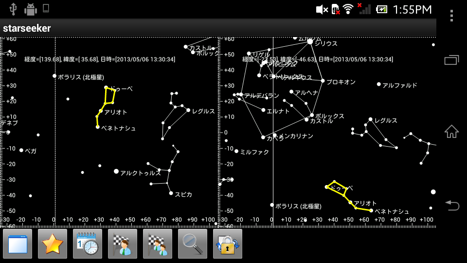

## コンセプト ##
会社帰りに夜空を見上げると、星がキラキラとまたたいています。  
しかしプラネタリウムとは違い、実際の星空ではどれがどれだかわかりません。  

今自分が見ている空には、どんな星や星座が輝いているのかがわかればもっと家路が楽しくなると考えて作りました。  
このアプリで、夜空を見上げる機会が増えたら嬉しいです。  

## アプリの機能 ##

* スマートフォンを向けた方角の星空を簡易的にシミュレートします。
* 観測条件を指定できます。
    * 何等星まで表示するか？
    * 観測日時
    * 観測地点
* 指定した星座を強調表示することができます。  
~~指定した星座が表示領域に含まれない時は、その方向を表示します。~~　こちらは時間が足りなくてできなかった...
* 画面分割ができます。  
異なる２地点における同日同時刻での星空を比較することができます。

## 利用方法 ##

### １地点観測 ###

機能ボタンを左側から説明します

|機能|概要|補足|
|--|--|--|
|画面分割|スマートフォンを縦に持っているときは、上下に２分割します。横持ちのときは左右に２分割します。　もう一度押すと分割を解除します。||
|表示する等級|表示する星の等級の下限を指定します。|
|観測日時|観測地点１と２のローカル時間を指定します。|ローカル時間をタイムゾーンで補正したUTCで座標計算します|
|観測地点１|１つ目の観測地点を指定します。||
|観測地点２|２つ目の観測地点を指定します。|画面分割をしていないときは指定できません。|
|探索する星座|強調表示する星座を指定します。|
|回転ロック|画面回転をロックします|スマートフォン側を「画面設定＞画面の自動回転」をONにしていないと機能しません。|

### ２地点観測 ###

画面分割して、２地点観測モードにした場合の画面イメージです

## ロジック ##
* 星の座標計算 ... [天文計算入門](http://star.gs/nyumon/sekido.htm)の記述を参考にしました。  
計算式の一部が理解できずときどき計算結果がずれますが、どうにも修正できませんでした。　無念

## 利用したデータ ##

* 星データ ... [NASA](http://heasarc.gsfc.nasa.gov/cgi-bin/W3Browse/w3query.pl?&tablehead=name%3Dheasarc_hipparcos%26description%3DHipparcos+Main+Catalog%26url%3Dhttp%3A%2F%2Fheasarc%2Egsfc%2Enasa%2Egov%2FW3Browse%2Fstar-catalog%2Fhipparcos%2Ehtml%26archive%3D%26radius%3D3%26mission%3DSTAR%2BCATALOG%26priority%3D3&mission=STAR+CATALOG&Action=More+Options&Action=Parameter+Search&ConeAdd=1)からダウンロード。　データ件数は1600強です
* 星座の名前 ... [星空横丁](http://hoshizora.yokochou.com/constellation/)からダウンロード。　NASAのサイトには見つからなかった... orz
* 星座の経路 ... どこにも利用できるデータがなかったので、Wikipediaを見ながら１つ１つ定義しました。　間違いがあるかもしれません。  
結構手間がかかる作業のため１２星座＋αしか定義できていません。

## JUnit ##

JUnitでstarseeker-testを実行する場合には、次の手順をふんでください。

1. プロジェクト参照を追加
    1. starseeker-testのプロパティを開く
    2. starseekerプロジェクトの参照を追加
           java-buildpath -> project から starseeker を追加
    3. JUNITの構成を変更
           実行構成 -> 引数 -> 作業ディレクトリ= その他, value=${workspace_loc:starseeker}
    4. JUNITの実行
